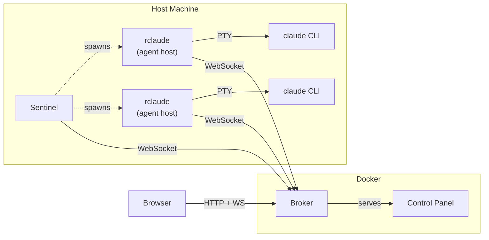

```
   ________    ___   __  ______  _______       ____________  __ __
  / ____/ /   /   | / / / / __ \/ ____/ |     / / ____/ __ \/ //_/
 / /   / /   / /| |/ / / / / / / __/  | | /| / / __/ / /_/ / ,<
/ /___/ /___/ ___ / /_/ / /_/ / /___  | |/ |/ / /___/ _, _/ /| |
\____/_____/_/  |_\____/_____/_____/  |__/|__/_____/_/ |_/_/ |_|
        ┌───────────────────────────────────────────────┐
        │  DISTRIBUTED SESSION FABRIC FOR CLAUDE CODE   │
        └───────────────────────────────────────────────┘
```

---

> **v1.0.0 / Wire Protocol v2 (2026-05-04) is a HARD BREAK.**\
> Old agent hosts can't talk to a new broker, and vice versa. Upgrade
> both sides at the same time:
> ```bash
> bun install -g @claudewerk/claude-agent-host @claudewerk/sentinel
> ```
> See [CHANGELOG.md](./CHANGELOG.md) for what changed and why. Old
> binaries that try to connect get a `protocol_upgrade_required` reply
> + a copy-pastable upgrade command in the dashboard.

---

## What is this?

**CLAUDEWERK** turns Claude Code from a local-only CLI tool into a remotely
accessible, multi-machine AI workstation you can monitor and control from
anywhere.

Run `rclaude` instead of `claude`. It wraps the CLI with a PTY, injects hooks,
and streams everything -- events, transcripts, terminal I/O, tasks, sub-agents
-- over a single WebSocket to a central broker. Open the control panel on your
phone, your iPad, a borrowed laptop. Your Claude sessions are right there, live,
with full interactive terminal access.

**The killer feature: tunnel a real TTY to your running Claude session over the
web.** Not a log viewer. Not a read-only transcript. A full interactive terminal
-- xterm.js backed by the actual PTY process on your host machine. Type commands,
approve tool calls, paste code, resize the window. It's your terminal, streamed
through a WebSocket tunnel to any browser on any device.

Sitting on the couch with your iPad? Open the control panel, tap your session,
hit the TTY button. You're in. Full terminal. Same session your desktop started.
On a friend's laptop and need to check on a long-running Claude task? Log in
with your passkey, open the terminal, and you're there. No SSH keys to
configure, no VPN to connect, no port forwarding to set up.

## Why does this exist?

Claude Code is incredible but it's trapped in your terminal. You start a big
task, walk away, and have no idea what happened until you come back to the same
machine, the same terminal, the same tmux session. If you're running Claude on
multiple projects across multiple machines, there's no way to see all of them
in one place.

This fixes that. All of it.

## Architecture



**Data flow:** `rclaude` (the agent host) wraps the `claude` CLI with a PTY,
injects hooks, and streams everything (events, transcripts, tasks, terminal
output) to the broker over a single WebSocket. The broker holds hot sessions
in memory for fast routing and writes everything through to a unified SQLite
`store.db` (sessions, transcripts, events, KV, messages, shares, address book,
scope links, tasks, cost turns, hourly rollups). Analytics and the project
registry live in sibling SQLite files. Nothing touches the host filesystem --
the Docker volume is the single source of truth.

**Backends x transports:** claudewerk hosts the `claude` backend across three
transports -- `claude-pty` (interactive terminal, the TTY tunnel above),
`claude-headless` (stream-json over stdin/stdout), and `claude-daemon` (the
`cc-daemon` background-worker socket). The daemon transport is the **default
for agent-spawned conversations** (MCP `spawn_conversation`, inter-conversation
`channel_spawn`): it bills the Claude subscription pool and survives an
agent-host crash. Control-panel launches always name a transport explicitly, so
PTY and headless stay one click away. See `docs/daemon-mode.md`.

**Project URIs** are canonical: `claude://default/{absolute_path}`. The
authority slot is the sentinel name (`default` = local install; multi-sentinel
fills in real host names). See `src/shared/project-uri.ts` for parse /
normalize / match / compare helpers.

### Components

| Component | Binary | What it does |
|-----------|--------|-------------|
| **Agent Host** | `rclaude` | CLI agent host. Spawns claude with PTY, injects hooks, MCP channel server, streams to broker |
| **Broker** | `broker` | Central server. Hono HTTP + WS + WebAuthn + inter-session routing + voice relay. Runs in Docker |
| **Control Panel** | *(web)* | React SPA. Vite + Tailwind + Zustand. Voice, terminal, transcript, DnD, chat. Served by broker |
| **Sentinel** | `sentinel` | Host-side daemon. Spawns/revives agent hosts, manages tmux sessions |
| **Broker CLI** | `broker-cli` | Ops CLI. Manage users + passkeys, absorb legacy files (`migrate`), read-only SQL inspection (`query`) |

### Vocabulary

| Term | Meaning |
|------|---------|
| **Conversation** | User-owned persistent thread. Survives `/clear`, reconnect, revival, reboot |
| **Agent Host** | Process that runs an Agent (currently `rclaude` wrapping Claude Code) |
| **Agent** | The AI doing work inside an agent host (Claude Code today) |
| **Broker** | Central server that routes, persists, and authorizes |
| **Sentinel** | Host-scoped daemon that spawns and supervises agent hosts |
| **Control Panel** | Browser UI for monitoring and controlling the fabric |
| **Conduit** | Inter-agent-host messaging primitive (`conduit.send(to, intent, msg)`) |
| **CC Run** | One Claude Code process instance (dies on `/clear`, replaced by a new one) |

---

## What makes it awesome

### Live Terminal Over the Web

Full xterm.js terminal tunneled through WebSocket to your host's PTY. Not a
simulation -- the real terminal, with all its state, colors, cursor position,
and scroll buffer. Works on phones, tablets, laptops, anything with a browser.
Popout to a separate window with Shift+click. Multiple terminal themes
(Dracula, Tokyo Night, Monokai, etc.), adjustable fonts, touch-friendly toolbar
with Ctrl+C, paste, and copy buttons.

### Rich Remote Input

Send prompts to Claude from any device with a full markdown-aware input bar.
Syntax-highlighted as you type, Shift+Enter for multiline. Paste images from
clipboard, drag-and-drop files, or use the attach button to upload -- images
are embedded inline and sent to Claude as context. Voice recording support for
hands-free input on mobile.

### Real-Time Transcript

Watch Claude work in real-time from anywhere. Full transcript with
syntax-highlighted code blocks (Shiki), inline images, markdown rendering, and
diff visualization. See every tool call as it happens -- Bash commands, file
reads, edits, grep results -- with expandable input/output details. Skill/command
content is auto-collapsed into compact teal pills. Auto-follow mode scrolls
with new content; scroll up to pause, scroll back down to resume.

### Multi-Machine Aggregation

Run Claude on your desktop, your server, your CI runner -- all sessions stream
to one broker. The control panel shows them all, grouped by project, with custom
labels, icons, and colors. Switch between sessions instantly with Cmd+P
(QuickSilver-style fuzzy finder). Never lose track of what's running where.

### Period Recap

Generate long-form markdown digests of what happened in a project (or across
all projects) over any window: today, yesterday, last 7/30 days, this week/
month, or a custom range. Recaps gather conversation transcripts, git
commits, project-board task changes, cost and token usage, tool-use
statistics, errors, and unanswered open questions, then call OpenRouter
(Haiku 4.5 by default, escalating to Sonnet 4 for large inputs) to produce
a YAML-frontmatter-headed markdown document with TL;DR, features shipped,
bug fixes, refactors, incidents, tasks completed, open questions, and
notable conversations. The cost/token table is rendered deterministically
from SQL -- the LLM never regenerates numbers.

Trigger from the command palette (`Cmd+P > Recap...`), the right-click
context menu on any project or conversation (Recap > Today / Yesterday /
Last 7 days / Custom range...), or via the four MCP tools (`recap_search`,
`recap_get`, `recap_list`, `recap_create`) so agents can read prior recaps
or kick off new ones from inside a conversation. Active jobs surface in a
floating widget at the bottom of the sidebar with live progress; failed
jobs stay visible for an hour with the error message; completed jobs flash
green for 3 seconds. The viewer modal renders the markdown via the same
renderer used in transcripts and provides Copy / Download / Share / View
raw actions. Share links produce a public, no-auth viewer URL at `/r/TOKEN`
with an isolated permission scope -- the share grants nothing beyond the
one stored markdown document.

Recaps are persisted forever (per decision 7 in the plan), indexed via FTS5
(`recaps_fts`) and a denormalized `recap_tags` table for hashtags / keywords
/ goals / stakeholders, and 5-min input-hash deduped so retriggering the
same period within the window returns the existing recap instead of
regenerating. Agents searching prior recaps via `recap_search` get
permission-filtered results (cross-project recaps are creator-only).

### Sub-Agent & Team Tracking

Claude spawns background agents? You see them. Live status badges show
running/completed state, event counts, and elapsed time directly in the
transcript. Click into any agent to see its full transcript. Team sessions show
teammate status, current tasks, and completion progress.

### Task & Background Process Monitoring

All tasks (pending, in-progress, completed) visible in a dedicated tab with
blocking relationships and owner assignments. Background Bash processes tracked
with their commands, descriptions, and run times.

### File Editor & Browser

Browse and edit markdown files in your session's working directory directly from
the control panel. CodeMirror-powered editor with syntax highlighting, version
history, and conflict detection. Hit Cmd+P and type `F:` to open the
QuickSilver-style file browser.

### Passkey-Only Authentication

No passwords. No API tokens. No self-registration. WebAuthn passkeys only.
New users can ONLY be created through CLI-generated invite codes -- there is
no web-based registration. Session cookies are HMAC-SHA256 signed. Revoked
users are blocked immediately.

### Multi-User Permissions

Fine-grained, grant-based access control. Permissions (`chat`, `chat:read`,
`files:read`, `files:write`, `terminal:read`, `terminal:write`) scoped to
specific projects. Temporal bounds (`notBefore`, `notAfter`) for time-limited
access. Enforced on every HTTP endpoint and every WS handler.

### Push Notifications

PWA push notifications when Claude needs your attention. Works on mobile
browsers -- get notified when sessions are waiting for input even when the tab
is closed or your phone is locked.

**Setup:** Generate VAPID keys and add them to your `.env`:

```bash
npx web-push generate-vapid-keys

# Add to .env
VAPID_PUBLIC_KEY=BPxr...your-public-key
VAPID_PRIVATE_KEY=abc...your-private-key
```

Restart the broker, then open Settings in the control panel and enable
notifications.

**Automatic triggers:** Push notifications fire on `Notification` hook (Claude
needs input) and `Stop` hook (Claude stopped working).

**Send from scripts/hooks:**

```bash
curl -X POST https://broker.example.com/api/push/send \
  -H "Authorization: Bearer $RCLAUDE_SECRET" \
  -H "Content-Type: application/json" \
  -d '{"title": "Build complete", "body": "Deploy finished in 42s"}'
```

### MCP Channel & Tools

When running with channels (default), Claude gets MCP tools for interacting
with the control panel:

| Tool | Description |
|------|-------------|
| `notify` | Send push notification to user's devices |
| `share_file` | Upload a file and get a public URL |
| `list_conversations` | Discover sessions (returns stable address book IDs) |
| `send_message` | Message a session by ID (delivers or queues if offline) |
| `configure_session` | Update project label/icon/color/keyterms |
| `spawn_session` | Launch a new session in a project |
| `control_session` | Stop another session |
| `toggle_plan_mode` | Switch plan mode on/off |
| `check_update` | Check if a newer rclaude version is available on GitHub |

### Inter-Session Communication

Sessions can discover and message each other. `list_conversations` returns stable,
human-readable IDs that persist forever. Use these IDs with `send_message`
to talk to other sessions.

**Offline delivery:** Messages to disconnected sessions are queued and delivered
on reconnect. **Trust levels** control who can talk to whom (default requires
approval, open allows all, benevolent allows lifecycle control).

### Session Sharing

Share a live session with anyone via a temporary link -- no account needed.
Configurable permissions per share (chat, files, terminal). Expiry enforcement
with automatic cleanup. Revoke at any time.

### Voice Input

**Touch devices:** Floating hold-to-record FAB. Two-stage activation. Drag
left to cancel. Interim transcription via Deepgram.

**Desktop:** Configure any key as push-to-talk in Settings > Input. Hold to
record, release to submit.

### Clipboard Capture

When Claude copies text to clipboard, the control panel captures it as a cyan
banner with COPY/DISMISS buttons. Works via OSC 52 interception. Supports
both text and images.

### Durable SQLite storage

Everything persists through a unified SQLite `store.db` -- sessions, events,
transcripts, tasks, shares, inter-session messages, settings, cost turns,
hourly rollups, address book, project links. Transcripts are append-only with
cursor-based pagination and per-session `session_seq` counters for the
sync-check protocol. No 500-entry transcript cap, no 200-session cap, no
debounced JSON flushes.

On boot, the broker runs an idempotent migration gated by a schema-version
stamp in the KV table -- legacy JSON/JSONL files left over from the
pre-SQLite era are absorbed on first start, then the startup is a single
KV read on every subsequent boot. Use `broker-cli query "SELECT ..."` to
inspect any of the three SQLite databases (`store.db`, `analytics.db`,
`projects.db`) in readonly mode, against a live broker, without a DB client.

---

## Quick Start

### Prerequisites

- [Claude Code](https://claude.ai/code) CLI installed
- [Bun](https://bun.sh) runtime (v1.2+)
- Docker (for broker)

### Install via npm

The fastest way to get the agent host and sentinel running:

```bash
bun add -g @claudewerk/claude-agent-host @claudewerk/sentinel
```

This gives you `rclaude` and `sentinel` commands globally. Both run under Bun.

### Install via Docker

Run everything in a container -- includes Claude Code, Bun, Python, gh, and the full toolkit:

```bash
docker run -it \
  -e ANTHROPIC_API_KEY \
  -e CLAUDWERK_SENTINEL_SECRET=your-secret \
  -e CLAUDWERK_BROKER=wss://your-broker.example.com \
  -v $(pwd):/workspace/project \
  ghcr.io/claudewerk/claudewerk-runner:latest
```

The image includes: CC, rclaude, sentinel, opencode-host, bun, python3, gh, ripgrep, fd, neovim,
build-essential, sqlite3, tmux. Default CMD is `sentinel`.

See [claudewerk-runner](https://github.com/claudewerk/claudewerk) for full docs.

### Install from source

```bash
git clone https://github.com/claudification/claudewerk.git
cd claudewerk
./install.sh
```

The installer will:
1. Install [Bun](https://bun.sh) automatically if not found
2. Install all dependencies (root + web frontend)
3. Build all binaries (`rclaude`, `sentinel`, `broker`, `broker-cli`)
4. Symlink them to `~/.local/bin/`
5. Ask about broker setup (local Docker, remote, or skip)
6. Configure your shell (`~/.zshrc` or `~/.bashrc`)
7. Optionally alias `claude` to `rclaude`

### Manual install from source

```bash
curl -fsSL https://bun.sh/install | bash

bun install
cd web && bun install && cd ..

bun run build

mkdir -p ~/.local/bin
ln -sf "$(pwd)/bin/rclaude" ~/.local/bin/rclaude
ln -sf "$(pwd)/bin/sentinel" ~/.local/bin/sentinel

echo 'export PATH="$HOME/.local/bin:$PATH"' >> ~/.zshrc
```

### Shell configuration

Add to your `~/.zshrc` or `~/.bashrc`:

```bash
export RCLAUDE_SECRET="your-shared-secret-here"
export CLAUDWERK_BROKER="wss://broker.example.com"
```

Or for local development:

```bash
export RCLAUDE_SECRET="dev-secret"
export CLAUDWERK_BROKER="ws://localhost:9999"
```

Then use `rclaude` instead of `claude`:

```bash
rclaude                          # Start interactive session
rclaude --resume                 # Resume previous session
rclaude -p "fix the build"       # Non-interactive prompt
```

### Optional: alias claude to rclaude

```bash
alias claude=rclaude
alias ccc='rclaude --resume'
```

---

## Broker Deployment

The broker is the central server that aggregates sessions and serves the control
panel. It runs in Docker and requires no host filesystem access.

### Standalone (simple setup)

```bash
export RCLAUDE_SECRET=$(openssl rand -hex 32)
echo "RCLAUDE_SECRET=$RCLAUDE_SECRET" > .env

bun run build:web

docker compose -f docker-compose.standalone.yml up -d
```

Control panel at http://localhost:9999

### With Caddy for HTTPS

1. Copy the example Caddyfile:
   ```bash
   cp Caddyfile.example Caddyfile
   # Edit Caddyfile - replace YOUR_DOMAIN with your actual domain
   ```

2. Configure `.env`:
   ```bash
   RCLAUDE_SECRET=<your-secret>
   RP_ID=broker.example.com
   ORIGIN=https://broker.example.com
   CADDY_HOST=broker.example.com
   ```

3. Uncomment the `caddy` service in `docker-compose.standalone.yml`

4. Start:
   ```bash
   docker compose -f docker-compose.standalone.yml up -d
   ```

### With caddy-docker-proxy (advanced)

```bash
docker network create caddy 2>/dev/null || true

cat > .env << EOF
RCLAUDE_SECRET=$(openssl rand -hex 32)
RP_ID=broker.example.com
ORIGIN=https://broker.example.com
CADDY_HOST=broker.example.com
EOF

bun run build:web
scripts/docker-build-broker.sh
docker compose up -d
```

### With nginx or other reverse proxy

Run the standalone compose (no Caddy) and point your reverse proxy at port 9999:

```nginx
server {
    listen 443 ssl;
    server_name broker.example.com;

    location / {
        proxy_pass http://localhost:9999;
        proxy_http_version 1.1;
        proxy_set_header Upgrade $http_upgrade;
        proxy_set_header Connection "upgrade";
        proxy_set_header Host $host;
        proxy_set_header X-Real-IP $remote_addr;
        proxy_read_timeout 86400;
    }
}
```

WebSocket support is required. The `Upgrade` and `Connection` headers must be
forwarded, and `proxy_read_timeout` should be high (WebSocket connections are
long-lived).

### Environment variables

| Variable | Description | Default |
|----------|-------------|---------|
| `RCLAUDE_SECRET` | Shared secret for agent host WS auth | *(required)* |
| `RP_ID` | WebAuthn relying party ID (your domain, no protocol) | `localhost` |
| `ORIGIN` | Allowed WebAuthn origin (full URL) | `http://localhost:9999` |
| `PORT` | External port mapping | `9999` |
| `CADDY_HOST` | Caddy reverse proxy hostname | *(empty)* |
| `VAPID_PUBLIC_KEY` | VAPID public key for push notifications | *(optional)* |
| `VAPID_PRIVATE_KEY` | VAPID private key for push notifications | *(optional)* |

### Data volume

The `concentrator-data` Docker volume holds **everything**: three SQLite
databases (`store.db`, `analytics.db`, `projects.db`), the auth state
(`auth.json`, `auth.secret`, `passkeys.*`), the blob store (`blobs/`),
model pricing cache, and crash reports. Back up the volume, back up the
whole broker.

```bash
# Snapshot backup -- ~1min for 1GB-scale data
BACKUP="concentrator-data-backup-$(date +%Y%m%d)"
docker volume create $BACKUP
docker run --rm \
  -v concentrator-data:/from:ro \
  -v $BACKUP:/to \
  alpine cp -a /from/. /to/
```

### Frontend hot-reload

The Docker compose mounts `./web/dist` over the baked-in frontend assets.
Rebuild the frontend on the host and changes appear immediately -- no container
restart needed:

```bash
bun run build:web
```

### Health check

```bash
curl http://localhost:9999/health
# Returns "ok" with 200
```

---

## Sentinel (host daemon)

The sentinel manages agent host processes on a machine. It spawns new sessions,
revives ended ones, and reports status to the broker.

### Running as a service (macOS)

```bash
cat > ~/Library/LaunchAgents/com.claudewerk.sentinel.plist << 'EOF'
<?xml version="1.0" encoding="UTF-8"?>
<!DOCTYPE plist PUBLIC "-//Apple//DTD PLIST 1.0//EN" "http://www.apple.com/DTDs/PropertyList-1.0.dtd">
<plist version="1.0">
<dict>
    <key>Label</key>
    <string>com.claudewerk.sentinel</string>
    <key>ProgramArguments</key>
    <array>
        <string>/Users/YOU/.local/bin/sentinel</string>
    </array>
    <key>RunAtLoad</key>
    <true/>
    <key>KeepAlive</key>
    <true/>
    <key>StandardOutPath</key>
    <string>/tmp/sentinel.log</string>
    <key>StandardErrorPath</key>
    <string>/tmp/sentinel.err</string>
    <key>EnvironmentVariables</key>
    <dict>
        <key>PATH</key>
        <string>/Users/YOU/.local/bin:/usr/local/bin:/usr/bin:/bin</string>
        <key>CLAUDWERK_BROKER</key>
        <string>wss://broker.example.com</string>
        <key>RCLAUDE_SECRET</key>
        <string>your-shared-secret-here</string>
    </dict>
</dict>
</plist>
EOF
```

Replace `/Users/YOU` with your home directory and set the correct broker URL
and secret.

```bash
launchctl load ~/Library/LaunchAgents/com.claudewerk.sentinel.plist
launchctl list | grep claudewerk
launchctl unload ~/Library/LaunchAgents/com.claudewerk.sentinel.plist
tail -f /tmp/sentinel.log
```

> **Note:** launchd does not inherit your shell environment. All required env
> vars must be in the plist's `EnvironmentVariables` dict.

---

## Authentication

The control panel is protected by **WebAuthn passkeys**. No passwords. No
self-registration. Passkeys can ONLY be created through CLI-generated invite
links.

### First-time setup

```bash
docker exec broker broker-cli create-invite \
  --name yourname \
  --url https://broker.example.com

# Or locally
broker-cli create-invite --name yourname
```

This prints a one-time invite link. Open it in your browser to register your
passkey. Invites expire after 30 minutes.

### Managing users

```bash
docker exec broker broker-cli list-users
docker exec broker broker-cli revoke --name badactor
docker exec broker broker-cli unrevoke --name rehabilitated
docker exec broker broker-cli set-role --name alice --role user-editor
docker exec broker broker-cli delete-passkey --name alice --credential-id <id>
```

**Rules:**
- Names must be unique
- Revoking a user terminates all their active sessions instantly
- Session cookies last 7 days, then re-authentication is required
- Users with `user-editor` role can manage grants and invites from the control panel UI

---

## Keyboard Shortcuts

| Shortcut | Action |
|----------|--------|
| `Cmd+P` | Command palette (fuzzy finder) |
| `Cmd+P` then `F:` | File browser |
| `Cmd+P` then `S:` | Spawn conversation picker |
| `Cmd+P` then `>` | Command mode (system actions) |
| `Cmd+G` + letter | Chord shortcuts (navigation/conversation actions) |
| `Cmd+B` | Toggle sidebar |
| `Cmd+O` | Toggle verbose / expand all |
| `Cmd+Shift+P` | Command palette (command mode) |
| `Shift+Click` TTY badge | Popout terminal to separate window |
| `Escape` | Close modal / home |
| `Escape Escape` | Interrupt |

**Input bar:**

| Shortcut | Action |
|----------|--------|
| `Enter` | Submit prompt |
| `Shift+Enter` | New line |
| `Cmd+V` / Paste | Paste text or images |

---

## CLI Reference

### rclaude (agent host)

```
rclaude [OPTIONS] [CLAUDE_ARGS...]

OPTIONS:
  --broker <url>           Broker WebSocket URL (default: ws://localhost:9999)
  --rclaude-secret <s>     Shared secret for broker auth (or RCLAUDE_SECRET env)
  --no-broker              Run without forwarding to broker
  --no-terminal            Disable remote terminal capability
  --no-channels            Disable MCP channel (channels are ON by default)
  --channels               Enable MCP channel (already default, for explicitness)
  --rclaude-version        Show build version
  --rclaude-check-update   Check if a newer version is available on GitHub
  --rclaude-import-history --sentinel <alias> [--since <YYYY-MM-DD>] [--dry-run] [--include-agents]
                           Upload this machine's local Claude history
                           (~/.claude/projects) to the broker so it's searchable
                           across machines. Idempotent (safe to re-run). <alias>
                           must be a registered sentinel alias; sub-agent
                           transcripts and sessions already live on the broker
                           are skipped by default
  --rclaude-help           Show rclaude help

All other arguments pass through to claude CLI.
```

**Environment variables:**

| Variable | Description |
|----------|-------------|
| `RCLAUDE_SECRET` | Shared secret (alternative to `--rclaude-secret`) |
| `CLAUDWERK_BROKER` | Broker URL (preferred). Fallbacks: `RCLAUDE_BROKER`, `RCLAUDE_CONCENTRATOR` |
| `RCLAUDE_CHANNELS` | Set to `0` to disable MCP channel |
| `RCLAUDE_DEBUG` | Set to `1` to enable debug logging |
| `RCLAUDE_DEBUG_LOG` | Debug log file path (default: `/tmp/rclaude-debug.log`) |

### broker

```
broker [OPTIONS]

OPTIONS:
  -p, --port <port>        Port (default: 9999)
  -v, --verbose            Enable verbose logging
  -w, --web-dir <dir>      Serve control panel from directory
  --cache-dir <dir>        Cache directory (default: ~/.cache/broker)
  --clear-cache            Clear cache and exit
  --no-persistence         Disable session persistence
  --rp-id <domain>         WebAuthn relying party ID (default: localhost)
  --origin <url>           Allowed WebAuthn origin (repeatable)
  --rclaude-secret <s>     Shared secret for agent host auth
  -h, --help               Show help
```

### broker-cli

```
broker-cli <command> [OPTIONS]

COMMANDS:
  create-invite --name <name>                           Create a one-time passkey invite link
  list-users                                            List all registered users
  revoke --name <name>                                  Revoke a user's access
  unrevoke --name <name>                                Restore a revoked user
  set-role --name <name> --role <role>                  Add a server role
  remove-role --name <name> --role <role>               Remove a server role
  list-passkeys --name <name>                           List passkeys for a user
  delete-passkey --name <name> --credential-id <id>     Delete a passkey
  migrate [--dry-run]                                   Absorb legacy JSON/JSONL into store.db
  query [--db <name>] [--json] "SQL"                    Read-only SQL inspection
  termination list|show|grep [filters]                  Query the conversation termination NDJSON log

OPTIONS:
  --cache-dir <dir>    Storage directory (default: ~/.cache/broker)
  --url <url>          Base URL for invite links (default: http://localhost:9999)
  --not-before <date>  Grant valid from (ISO 8601)
  --not-after <date>   Grant valid until (ISO 8601)
  --db <name>          Database name for `query`: store (default) | analytics | projects
  --json               JSON output (otherwise tab-separated rows with header)
```

#### Read-only SQL inspection (`broker-cli query`)

Opens any of the broker's SQLite databases in readonly mode and runs the given SQL.
Safe to run against a live broker: readonly open, no locking beyond WAL readers.

```bash
# Top 10 projects by turn count (against the unified store.db, default)
broker-cli query "SELECT project_uri, COUNT(*) as turns FROM turns
                   GROUP BY 1 ORDER BY turns DESC LIMIT 10"

# Active sessions via JSON
broker-cli query --json "SELECT id, scope, status FROM sessions WHERE status = 'active'"

# Inside the Docker container
docker exec broker broker-cli query --cache-dir /data/cache \
  "SELECT COUNT(*) FROM turns"

# Aligned columns
broker-cli query "SELECT * FROM kv LIMIT 5" | column -t -s $'\t'

# Analytics DB (separate file, also queryable)
broker-cli query --db analytics "SELECT model, COUNT(*) FROM turns GROUP BY 1"

# Project registry
broker-cli query --db projects "SELECT id, scope, label FROM projects"
```

#### Termination history (`broker-cli termination`)

Every conversation that flips to `status: ended` writes one NDJSON record to
`{cacheDir}/terminations/YYYY-MM-DD.ndjson` with the typed `TerminationSource`
(dashboard-launch-toast, reaper-phantom, cc-exit-crash, ...), the initiator
(`user:lisa`, `agent:conv_abc`, `system:reaper`), the project URI, the
conversation title, and structured detail. Daily-rotated, 30-day retention,
sweep runs once a day. This is the single source of truth for "who killed
conversation X" investigations -- the in-memory diagLog is incomplete and
lost on broker restart, the NDJSON log isn't.

```bash
# Recent terminations (last 7 days, 50 newest)
broker-cli termination list

# Filter by source enum (single value or comma-separated)
broker-cli termination list --source dashboard-launch-toast
broker-cli termination list --source 'cc-exit-crash,reaper-phantom' --days 30

# Who killed which conversations today
broker-cli termination list --initiator 'user:lisa' --days 1

# All terminations (revives -> ends -> revives) for one conversation
broker-cli termination show --conv 556bd4ed-d247-4f26-8549-b41ad413cb56

# Substring search across NDJSON (case-sensitive)
broker-cli termination grep 'connection_closed' --days 14

# Raw JSON output for scripts
broker-cli termination list --json | jq 'select(.source == "reaper-phantom")'

# Inside the Docker container (the cacheDir is the concentrator-data volume)
docker exec broker broker-cli termination list --cache-dir /data/cache --limit 100
docker exec broker broker-cli termination show --conv <conversationId> --cache-dir /data/cache
```

`TerminationSource` enum values (defined in `src/shared/protocol.ts`):
`dashboard-context-menu`, `dashboard-terminate-dialog`,
`dashboard-lineage`, `dashboard-terminate-project`,
`dashboard-launch-toast`, `dashboard-other`, `inter-conversation-restart`,
`mcp-exit-session`, `headless-input`, `cc-exit-normal`, `cc-exit-crash`,
`ws-close`, `reaper-phantom`, `sentinel-kill`, `unknown`.

The same data is also reachable via HTTP:
- `GET /conversations/:id/termination` -- current `endedBy` + history (any auth)
- `GET /api/terminations?source=X&initiator=Y&days=N&grep=TEXT` -- admin only

### Auto-migration on startup

On every broker boot, `runStartupMigration()` checks the schema-version stamp
in `store.kv` and runs any missing steps idempotently:

- **v1:** absorb legacy `sessions.json`, `transcripts/*.jsonl`, `cost-data.db`,
  and all the other small JSON files into the unified `store.db`.
- **v2:** canonicalize every project URI in `store.db` + `analytics.db` to
  `claude://default/{path}` (collapses pre-2026-04-25 `claude:////path` scars
  and upgrades authority-less `claude:///path` forms).

When the stamp is current, startup is a single KV read -- no scanning, no
migration noise. Use `broker-cli migrate --dry-run --cache-dir /data/cache`
to preview what legacy files a fresh install would absorb.

---

## REST API

All API endpoints require authentication (passkey cookie or
`Authorization: Bearer $RCLAUDE_SECRET`).

### Conversations

```
GET  /health                                             Health check (public)
GET  /conversations                                      List conversations (?active=true)
GET  /conversations/:id                                  Conversation details
GET  /conversations/:id/events                           Hook events
GET  /conversations/:id/subagents                        Sub-agent list
GET  /conversations/:id/transcript                       Transcript entries
GET  /conversations/:id/subagents/:aid/transcript        Sub-agent transcript
GET  /conversations/:id/tasks                            Tasks + background tasks
GET  /conversations/:id/diag                             Full diagnostic dump
POST /conversations/:id/input                            Send input to conversation
POST /conversations/:id/revive                           Revive ended conversation
DELETE /conversations/:id                                Dismiss ended conversation
```

### Spawn & Sentinel

```
POST /api/spawn                                 Spawn new conversation
GET  /sentinel/status                           Sentinel connection status
POST /sentinel/quit                             Request sentinel quit
GET  /api/sentinel/diag                         Sentinel diagnostics
```

### Settings & Organization

```
GET  /api/settings                              Global settings
POST /api/settings                              Update global settings
GET  /api/settings/projects                     Project settings
POST /api/settings/projects                     Create/update project settings
DELETE /api/settings/projects                   Delete project settings
POST /api/settings/projects/generate-keyterms   AI-generate project keywords
GET  /api/project-order                          Project tree order
POST /api/project-order                          Update project tree order
```

### Inter-Conversation Links

```
GET  /api/links                                 List links + trust levels
POST /api/links                                 Create/update link
DELETE /api/links                               Remove link
GET  /api/links/messages                        Message history
```

### Conversation Shares

```
POST /api/shares                                Create share link
GET  /api/shares                                List active shares
DELETE /api/shares/:token                       Revoke share
```

### Files & Sharing

```
POST /api/files                                 Upload file (multipart)
GET  /file/:hash                                Download shared file
GET  /api/shared-files                          List shared files
DELETE /api/shared-files/:hash                  Delete shared file
GET  /api/dirs                                  List directories for spawn
```

### Push Notifications

```
GET  /api/push/vapid                            VAPID public key
POST /api/push/subscribe                        Register push subscription
POST /api/push/unsubscribe                      Remove push subscription
POST /api/push/send                             Send push (Bearer token)
```

### Voice & Misc

```
POST /api/transcribe                            Voice transcription (Deepgram)
GET  /api/capabilities                          Server capabilities
GET  /api/stats                                 WS connection statistics
GET  /api/subscriptions                         Subscription diagnostics
POST /api/crash                                 Report client crash
GET  /api/crashes                               List recent crash reports
```

---

## Hook Events

| Event | Description |
|-------|-------------|
| `SessionStart` | New session with model, cwd, transcript path |
| `SessionEnd` | Session terminated |
| `UserPromptSubmit` | User entered a prompt |
| `PreToolUse` | About to execute a tool |
| `PostToolUse` | Tool execution completed |
| `PostToolUseFailure` | Tool execution failed |
| `Stop` | Claude stopped (waiting for input) |
| `StopFailure` | Turn ended due to API error |
| `Notification` | System notification |
| `SubagentStart` | Spawned a sub-agent |
| `SubagentStop` | Sub-agent completed |
| `PreCompact` | Context window compaction started |
| `PostCompact` | Context window compaction finished |
| `PermissionRequest` | Tool needs user approval |
| `TeammateIdle` | Team member waiting for work |
| `TaskCompleted` | Task finished in team context |
| `InstructionsLoaded` | CLAUDE.md / config loaded |
| `ConfigChange` | Settings changed |
| `WorktreeCreate` | Git worktree created for agent |
| `WorktreeRemove` | Git worktree cleaned up |
| `Elicitation` | Structured question sent to user |
| `ElicitationResult` | User answered structured question |
| `Setup` | Initial setup event |

See [IMPORTANT-HOOKS.md](./IMPORTANT-HOOKS.md) for the complete reference.

---

## Project Structure

```
claudewerk/
├── bin/                          Built binaries (gitignored)
│   ├── rclaude                   Agent host CLI
│   ├── sentinel                  Host daemon
│   ├── broker                    Central server
│   └── broker-cli                Auth management CLI
├── src/
│   ├── agent-host/               rclaude implementation
│   │   ├── index.ts              CLI entry, session lifecycle
│   │   ├── pty-spawn.ts          PTY subprocess management + OSC 52
│   │   ├── ws-client.ts          WebSocket client with reconnection
│   │   ├── transcript-watcher.ts JSONL file watcher
│   │   ├── mcp-channel.ts        MCP Streamable HTTP server
│   │   ├── local-server.ts       Hook callback + MCP endpoint
│   │   ├── file-editor.ts        File operations for control panel editor
│   │   ├── osc52-parser.ts       Clipboard capture (OSC 52 interception)
│   │   ├── permission-rules.ts   Auto-approve rules from rclaude.json
│   │   ├── settings-merge.ts     Claude settings injection
│   │   └── debug.ts              Debug logging
│   ├── broker/                   Server implementation
│   │   ├── index.ts              Server startup, Bun.serve
│   │   ├── message-router.ts     WS message dispatch
│   │   ├── handler-context.ts    HandlerContext type, guards
│   │   ├── create-context.ts     Context factory
│   │   ├── handlers/             WS message handlers (one file per domain)
│   │   ├── routes.ts             HTTP routes composition root
│   │   ├── routes/               Per-domain route modules
│   │   ├── __tests__/            bun:test behavioral tests
│   │   ├── conversation-store.ts  Runtime conversation registry (hot cache over StoreDriver)
│   │   ├── conversation-store/   Domain modules (sync-protocol, broadcast, spawn-jobs, ...)
│   │   ├── store/                Unified StoreDriver (SQLite + in-memory)
│   │   │   ├── types.ts            Interface contracts (SessionStore, TranscriptStore, CostStore, ...)
│   │   │   ├── sqlite/             SQLite implementation (all SQL lives here)
│   │   │   ├── memory/             In-memory implementation (tests + proof of contract)
│   │   │   ├── migrate.ts          Legacy JSON/JSONL absorb + runStartupMigration
│   │   │   ├── migrate-cli.ts      broker-cli migrate
│   │   │   └── query-cli.ts        broker-cli query (readonly SQL)
│   │   ├── project-store.ts      Project registry (separate projects.db, integer PKs)
│   │   ├── analytics-store.ts    Tool-use analytics (separate analytics.db)
│   │   ├── project-order.ts      Tree-based project organization (backed by store.kv)
│   │   ├── project-links.ts      Inter-project trust (backed by store.scopeLinks)
│   │   ├── address-book.ts       Per-caller routing slugs (backed by store.addressBook)
│   │   ├── message-queue.ts      Offline message queue (backed by store.messages)
│   │   ├── auth.ts               WebAuthn passkey auth (backed by auth.json)
│   │   ├── auth-routes.ts        Auth HTTP endpoints
│   │   ├── push.ts               Web Push notifications (VAPID)
│   │   ├── voice-stream.ts       Deepgram voice transcription
│   │   ├── global-settings.ts    Server-wide settings (backed by store.kv)
│   │   ├── project-settings.ts   Per-project label/icon/color/trust (backed by store.kv)
│   │   ├── shares.ts             Session sharing (backed by store.shares)
│   │   └── cli.ts                broker-cli entry (auth + migrate + query)
│   ├── sentinel/                 Host daemon
│   │   └── index.ts              Spawn + WS listener
│   └── shared/
│       ├── protocol.ts           WebSocket protocol types
│       ├── path-guard.ts         File path validation
│       ├── diff.ts               Diff utilities
│       ├── update-check.ts       GitHub-based update checking
│       └── version.ts            Build-time git hash + timestamp
├── web/                          Control panel (React SPA)
│   └── src/
│       ├── components/           UI components
│       ├── hooks/                Zustand stores
│       ├── lib/                  Shared utilities
│       └── styles/               Tokyo Night theme
├── scripts/                      Build scripts, helpers
├── schemas/                      JSON schemas
├── install.sh                    Interactive installer
├── Dockerfile                    Multi-stage build
├── docker-compose.yml            Production (caddy-docker-proxy)
├── docker-compose.standalone.yml Standalone deployment
└── Caddyfile.example             Caddy config template
```

---

## Development

```bash
bun install && cd web && bun install && cd ..

bun run dev:claude-agent-host              # Agent host (hot reload)
bun run dev:broker               # Broker (hot reload)
bun run dev:web                  # Control panel (Vite dev server)

bun run typecheck                # TypeScript check
bunx biome check --write .       # Lint + format

bun run build                    # Build everything
bun run build:web                # Control panel -> web/dist/
bun run build:claude-agent-host            # rclaude -> bin/rclaude
bun run build:broker             # broker -> bin/broker
bun run build:cli                # broker-cli -> bin/broker-cli
bun run build:sentinel           # sentinel -> bin/sentinel
```

---

## Shell Integration

### Agent Host function (`cc` / `ccc`)

```bash
cc() {
  local safe_mode=false
  local tmux_mode=false
  local no_rclaude=false
  local named_session=""
  local args=()

  if [[ -f ".claude/settings.local.json" ]]; then
    named_session=$(jq -r '.["tmux-session-name"] // empty' .claude/settings.local.json 2>/dev/null)
    if [[ -n "$named_session" ]]; then
      tmux_mode=true
    fi
  fi

  for arg in "$@"; do
    case "$arg" in
      --safe)       safe_mode=true ;;
      --tmux)       tmux_mode=true ;;
      --no-tmux)    tmux_mode=false; named_session="" ;;
      --no-rclaude) no_rclaude=true ;;
      *)            args+=("$arg") ;;
    esac
  done

  local base_cmd="rclaude"
  if [[ "$no_rclaude" == true ]] || ! command -v rclaude &>/dev/null; then
    base_cmd="claude"
  fi

  local cmd="$base_cmd"
  if [[ "$safe_mode" == false ]]; then
    cmd="$cmd --dangerously-skip-permissions"
  fi

  if [[ ${#args[@]} -gt 0 ]]; then
    cmd="$cmd ${args[@]}"
  fi

  if [[ "$tmux_mode" == false ]]; then
    eval "$cmd"
    return
  fi

  if [[ "$TERM_PROGRAM" == "vscode" ]] || [[ "$TERMINAL_EMULATOR" == "JetBrains-JediTerm" ]]; then
    echo "Warning: tmux mode ignored in IDE terminal"
    eval "$cmd"
    return
  fi

  if [[ -n "$TMUX" ]]; then
    if [[ -n "$named_session" ]]; then
      local current_session=$(tmux display-message -p '#S')
      if [[ "$current_session" != "$named_session" ]]; then
        if ! tmux has-session -t "$named_session" 2>/dev/null; then
          tmux new-session -d -s "$named_session" -c "$PWD" -n "$named_session" "$cmd"
        fi
        tmux switch-client -t "$named_session"
        return
      fi
    fi
    eval "$cmd"
    return
  fi

  if [[ -n "$named_session" ]]; then
    if ! tmux has-session -t "$named_session" 2>/dev/null; then
      tmux new-session -d -s "$named_session" -c "$PWD" -n "$named_session" "$cmd"
    fi
    tmux attach -t "$named_session"
  else
    local session_name="claude-$$"
    tmux new-session -d -s "$session_name" -c "$PWD" "$cmd"
    tmux attach -t "$session_name"
  fi
}

ccc() { cc -c "$@"; }
```

| Flag | Effect |
|------|--------|
| `--safe` | Don't skip permissions (interactive approval mode) |
| `--tmux` | Force tmux wrapping even without project config |
| `--no-tmux` | Disable tmux wrapping even if project config exists |
| `--no-rclaude` | Use plain `claude` instead of `rclaude` |

---

## Security

### WebSocket auth

Agent hosts authenticate to the broker with a shared secret (`RCLAUDE_SECRET`).
Connections without a valid secret are rejected.

### WebAuthn

- No passwords, no tokens in URLs, no bearer auth to leak
- Passkey registration requires a CLI-generated invite
- Session cookies are HMAC-SHA256 signed
- Revoked users are blocked immediately

### Permission enforcement

- **HTTP:** Every endpoint is gated by grant checks
- **WebSocket:** All handlers use `requirePermission()` guards
- **Broadcasts:** Session events use `broadcastSessionScoped()` -- users only receive events for sessions they have access to
- **Share viewers:** Restricted to their specific session scope
- **Grant expiry:** Temporal bounds enforced at check time

---

## Distribution

### npm packages

Published under the [`@claudewerk`](https://www.npmjs.com/org/claudewerk) org:

| Package | Binary | Install |
|---------|--------|---------|
| [`@claudewerk/claude-agent-host`](https://www.npmjs.com/package/@claudewerk/claude-agent-host) | `rclaude` | `bun add -g @claudewerk/claude-agent-host` |
| [`@claudewerk/sentinel`](https://www.npmjs.com/package/@claudewerk/sentinel) | `sentinel` | `bun add -g @claudewerk/sentinel` |

Both are single-file JS bundles with a `#!/usr/bin/env bun` shebang. Requires Bun.

### Docker image

[`ghcr.io/claudewerk/claudewerk-runner`](https://github.com/claudewerk/claudewerk/pkgs/container/claudewerk-runner)

Pre-built image with CC, rclaude, sentinel, opencode-host, and a full dev toolkit.

```bash
docker pull ghcr.io/claudewerk/claudewerk-runner:latest

docker run -it \
  -e ANTHROPIC_API_KEY \
  -e CLAUDWERK_SENTINEL_SECRET=your-secret \
  -e CLAUDWERK_BROKER=wss://your-broker.example.com \
  -v $(pwd):/workspace/project \
  ghcr.io/claudewerk/claudewerk-runner:latest
```

**Included tools:** Claude Code, bun, python3, gh, ripgrep, fd, neovim,
build-essential, sqlite3, tmux, git, curl, wget, jq.

**UID/GID mapping:** Pass `-e USER_UID=$(id -u) -e USER_GID=$(id -g)` to avoid
file ownership issues with mounted volumes.

### Building and publishing

```bash
# Build npm packages
bun run build:packages
cd packages/sentinel && npm publish --access public
cd packages/claude-agent-host && npm publish --access public

# Build and push Docker image (automated via GitHub Actions on tag push)
git tag v0.X.Y && git push --tags
```

---

## Tech Stack

- **Runtime**: [Bun](https://bun.sh) -- JavaScript runtime with native PTY support
- **Backend**: TypeScript, [Hono](https://hono.dev/) HTTP framework, WebSocket
- **Auth**: WebAuthn / FIDO2 passkeys via [@simplewebauthn](https://simplewebauthn.dev/)
- **Frontend**: React 19, Vite 7, Tailwind CSS v4, shadcn/ui
- **State**: [Zustand](https://github.com/pmndrs/zustand) for reactive stores
- **Terminal**: [xterm.js](https://xtermjs.org/) with WebGL renderer
- **Editor**: [CodeMirror](https://codemirror.net/) 6
- **Syntax**: [Shiki](https://shiki.matsu.io/) for code/diff highlighting
- **Diagrams**: [beautiful-mermaid](https://github.com/nicepkg/beautiful-mermaid) for Mermaid rendering
- **DnD**: [@dnd-kit](https://dndkit.com/) for drag-and-drop
- **Virtualization**: [@tanstack/react-virtual](https://tanstack.com/virtual)
- **Voice**: [Deepgram](https://deepgram.com/) live WebSocket transcription
- **Push**: Web Push API with VAPID

## License

MIT

---

<p align="center">
  <sub>Maintained by WOPR -- the only winning move is to monitor everything</sub>
</p>
