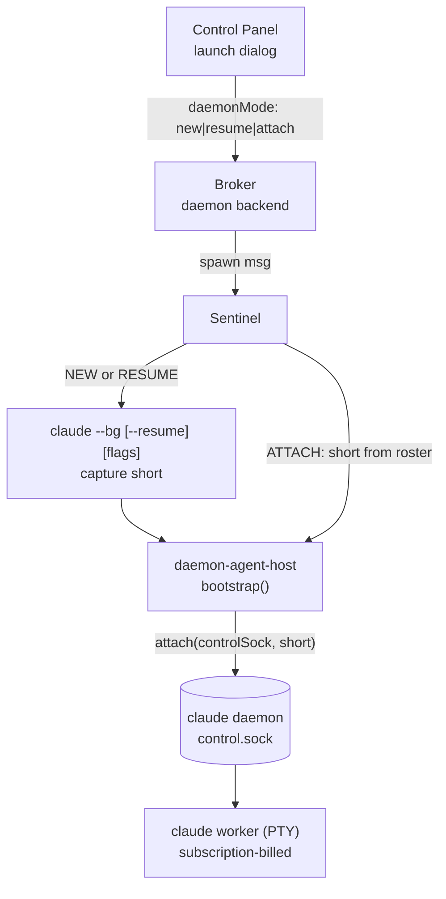

# CC Daemon Socket Protocol

Reference for how claudewerk speaks the Claude Code background-session daemon
(`claude daemon`) control socket. Covers socket location, framing, the three
dispatch modes, the `attach` handshake, 5-byte PTY framing, the `subscribe`
event schema, job-state lifecycle, and error handling.

**Protocol version:** `proto: 1`, verified against CC 2.1.143.\
**Implementation:** `src/shared/cc-daemon/` in this repo.\
**Full per-op recon:** `.claude/docs/cc-daemon-control-protocol.md` (binary
reverse-engineered notes + live-verification log).

---

## 1. Socket location and daemon lifecycle

```
/tmp/cc-daemon-<uid>/<8hex>/control.sock
```

The `<8hex>` segment is the instance directory -- a random 8-hex identifier
generated when the daemon starts. The directory also holds:

- `rv/<short>.sock` -- rendezvous socket per worker (one per job short ID)
- `spare/<id>.pty.sock` -- pre-warmed spare PTY sockets

The socket directory is uid-locked via `getpeereid`. Cross-uid connections are
rejected with `EPEERUID`.

**The daemon is transient.** It idle-exits when the last client lease AND the
last worker both drop. "Socket absent" is a normal steady state -- not an error.
`resolveControlSocket()` in `cc-daemon/socket-path.ts` returns `null` for absent;
callers treat `null` as "no daemon reachable right now, try again later."

### Socket resolution

`resolveControlSocket()` uses this priority order:

1. **Authoritative path:** parse `~/.claude/daemon/roster.json`, take a live
   worker's `rendezvousSock` field (e.g. `.../rv/aeb185f9.sock`), walk two
   path segments up to get the instance directory, then append `control.sock`.
2. **Fallback scan:** if the roster is absent or has no workers (daemon up but
   idle), scan `/tmp/cc-daemon-<uid>/` for instance directories that contain a
   `control.sock`, return the one with the newest mtime.

`resolveWorkerPtySock(short)` reads `roster.json` directly and returns the
`ptySock` path for that worker, or `null` if the worker or the roster is absent.

---

## 2. Wire framing

Two framings, picked by op:

| Framing | Used by | Shape |
|---|---|---|
| **Newline-delimited JSON** | All request/response ops, `subscribe`, rv sockets | `JSON.stringify(obj) + "\n"` |
| **5-byte binary** | Worker `ptySock` only | `[len:u32be][kind:u8][payload]` (see Section 5) |

The daemon sends zero bytes on connect -- it is request-driven with no banner.

Request/response ops are **one frame per connection**: the daemon answers one
line then closes. `client.ts`'s `request()` opens a fresh connection per call.

Streaming ops (`subscribe`, `attach`) hold the connection open.

Every client frame is stamped `{ proto: CC_DAEMON_PROTO, ... }` (`proto: 1`
today). See Section 7 for the proto gate.

---

## 3. The three dispatch modes

claudewerk launches daemon conversations in three modes. All three converge on
`cc-daemon/attach.ts` for PTY streaming. Only NEW and RESUME run `claude --bg`
first.

| Mode | Mechanism | Config injection | Who owns the short |
|---|---|---|---|
| **NEW** | `claude --bg [flags] <prompt>` -> capture short -> `attach` | YES -- `--settings`, `--mcp-config`, `--append-system-prompt`, env | Captured from `backgrounded - <8hex>` output |
| **RESUME** | `claude --bg --resume <sessionId> [flags] [<prompt>]` -> capture short -> `attach` | YES -- same set | Captured from `backgrounded - <8hex>` output |
| **ATTACH** | Worker already in daemon roster -> `attach` directly | NO -- worker is already configured | Taken from `DaemonAttachShort` in the spawn request |

`[flags]` for NEW/RESUME: `--model`, `--name`, `--settings <path>`,
`--mcp-config <path>`, `--append-system-prompt <text>`, plus any per-spawn
env vars merged into the worker process environment.

ATTACH skips `claude --bg` entirely. The sentinel validates `has(controlSock, short)`
before spawning the daemon-agent-host.



---

## 4. The `attach` handshake (live-verified, CC 2.1.143)

`attach` runs on `control.sock`, not the `ptySock`. The framing switches to raw
bytes after the ack -- the connection becomes a duplex terminal pipe.

### Step 1 -- send the attach request (newline-JSON)

```json
{
  "proto": 1,
  "op": "attach",
  "short": "<8hex worker id>",
  "cols": 220,
  "rows": 50,
  "attachId": "att_<random>",
  "caps": {
    "terminal": "xterm-256color",
    "mux": null,
    "ssh": false
  },
  "holdingFrame": true
}
```

The `caps` object is required when present. When included it REQUIRES `terminal`
(string or null), `mux` (`"tmux" | "screen" | "zellij" | null`), and `ssh`
(boolean). Sending `caps: {}` is rejected with `EUNKNOWN` (live-verified).
Optional cap fields: `wheelFlood`, `hyperlinks`, `progressReporting`, `wtSession`,
`isVscodeTerm`, `browser`, `colorLevel`, `editor`.

`holdingFrame: true` (default) asks the daemon to replay the current terminal
screen so the attacher gets an immediate paint.

`attachId` is a stable per-attacher identifier used for targeted `resize` calls.
claudewerk generates it as `att_<8 random chars>` if the caller does not supply
one.

### Step 2 -- receive the ack (newline-JSON)

On success:

```json
{
  "ok": true,
  "op": "attach",
  "decModes": [1049, 2004],
  "via": "spare",
  "tempo": "idle",
  "state": "working"
}
```

- `decModes` -- DEC private mode numbers the worker's terminal has enabled at
  attach time (needed for correct terminal emulation on reconnect).
- `via` -- how the worker PTY was provisioned (e.g. `"spare"` for a pre-warmed
  slot).
- `tempo` -- coarse activity tempo at attach time.
- `state` -- job state at attach time (see Section 6 for the full vocab).

On failure:

```json
{ "ok": false, "error": "...", "code": "ENOJOB" }
```

Possible failure codes at this step: `ENOJOB`, `EPROTO`, `EUNVERIFIED`,
`EKICKED`, `ESTARTING`. See Section 7 for handling.

### Step 3 -- raw PTY duplex (same connection)

After the newline that terminates the ack, the SAME connection becomes an
unframed raw terminal duplex:

- **Incoming bytes** (daemon -> claudewerk): raw PTY output from the worker.
- **Outgoing bytes** (claudewerk -> daemon): raw terminal input fed to the
  worker's PTY.

No framing wrapper. This is the same shape as claudewerk's existing PTY backend.
`attach.ts` passes incoming bytes directly to `onData`; outgoing bytes go via
`writeInput()`.

### Resize

`resize` is a SEPARATE request/response op, NOT an inline control frame on the
attach connection:

```json
{ "proto": 1, "op": "resize", "short": "<8hex>", "cols": 220, "rows": 50, "attachId": "att_<id>" }
```

Response:

```json
{ "ok": true, "op": "resize" }
```

With `attachId` it updates just that attacher's view; without it, it resizes
the underlying worker PTY. Live-verified against CC 2.1.143.

### Detach

Closing the connection (`.close()` on the socket) detaches the attacher without
killing the worker. The worker keeps running. Detach is non-destructive.

---

## 5. 5-byte PTY framing (worker `ptySock`, NOT used by `attach`)

The per-worker `ptySock` (path from `roster.json workers[<short>].ptySock`)
carries the same PTY bytes under a 5-byte binary framing:

```
[len:u32be][kind:u8][payload]
  bytes 0..3  payload length, big-endian uint32
  byte  4     frame kind: 0 = raw PTY bytes, 1 = control JSON
  bytes 5..   payload (len bytes)
```

Maximum frame payload: 1 MiB. Frames exceeding this limit cause a decode error.

Kind 0 carries raw terminal bytes in both directions. Kind 1 carries a control
JSON object tagged by a `t` field. Observed control messages (live-verified):
`{"t":"hello","replPid":...,"version":"2.1.143"}` on connect,
`{"t":"live"}` once the worker is streaming.

Live verification: frame header `00 00 00 31 01` decoded as len=49, kind=1,
and the 49-byte payload was exactly `{"t":"hello","replPid":...,"version":"2.1.143"}`.
1485 kind-0 + 2 kind-1 frames decoded cleanly off a live worker.

**claudewerk's `attach.ts` uses the simpler raw `control.sock` duplex, NOT the
`ptySock`.** The `ptySock` framing is implemented in `frame.ts` for any future
framed-`ptySock` consumer; the daemon launch UX does not use it.

---

## 6. `subscribe` event schema

`subscribe` holds a connection open and streams newline-JSON frames for one job.

### Request

```json
{ "proto": 1, "op": "subscribe", "short": "<8hex>", "tail": 200 }
```

`tail` is optional (default 200 scrollback lines).

### First frame -- snapshot

```json
{
  "type": "snapshot",
  "record": { ... },
  "streamTail": ["...", "..."]
}
```

`record` is a compact `JobRecord` (same shape `list` returns inline):

| Field | Type | Description |
|---|---|---|
| `short` | `string` | 8-hex worker ID |
| `sessionId` | `string` | The worker's CC session ID (a `ccSessionId`) |
| `cwd` | `string` | Working directory |
| `state` | `string` | Current job state (see Section 6.1) |
| `nonce` | `string?` | Dispatch nonce |
| `pid` | `number?` | Worker process PID |
| `attempt` | `number?` | Respawn attempt counter |
| `startedAt` | `number?` | Unix timestamp ms |
| `backend` | `string?` | Model backend identifier |
| `tempo` | `string?` | Coarse activity tempo |
| `detail` | `string?` | Human-readable status detail |
| `intent` | `string?` | Task intent summary |
| `name` | `string?` | Worker display name |
| `cliVersion` | `string?` | CC CLI version string |
| `source` | `string?` | Dispatch source (`shell`, `slash`, `fleet`, `spare`, `respawn`) |
| `needs` | `string?` | What the worker is waiting on (if blocked) |

`streamTail` is an array of raw PTY/ANSI byte strings (the terminal scrollback
tail). Monitoring-grade; for live interactive PTY use `attach`.

### Incremental frames

| `type` | Payload | Meaning |
|---|---|---|
| `stream` | `{ line: string }` | One new raw PTY/ANSI scrollback line |
| `state` | `{ patch: object }` | Partial `JobRecord` update (state/tempo/detail/...) |
| `settled` | `{ outcome: object }` | Terminal -- daemon closes the connection after this frame |

The `state` and `settled` frame schemas are binary-recovered but not live-verified
in claudewerk. The `SubscribeDelta` type in `subscribe.ts` intentionally stays
permissive; callers branch on `type` and read fields defensively.

### Usage in claudewerk

claudewerk's `session-observer.ts` uses `list` polling (not `subscribe`) to
derive `ccSessionId` from `JobRecord.sessionId`. The sentinel's `daemon-roster.ts`
uses `roster.json` + `list` for roster discovery. `subscribe` is available for
richer per-job state tracking if needed (e.g. Phase G permission-gate observation).

---

## 6.1 Job state lifecycle

The full state vocab the daemon uses in `JobRecord.state`:

```
starting  resuming  adopted  working  question  tool_use  midturn
blocked   done      failed   stopped  crashed   idle      running  active
```

Terminal states (job has ended): `done`, `failed`, `stopped`.
`crashed` is effectively terminal -- the worker exited abnormally.

### Mapping to claudewerk conversation status

`mapDaemonState()` in `src/broker/handlers/daemon.ts`:

| Daemon states | claudewerk `status` |
|---|---|
| `done`, `failed`, `stopped`, `crashed` | `ended` |
| `starting`, `resuming`, `adopted` | `starting` |
| `question`, `blocked`, `idle` | `idle` |
| everything else (`working`, `tool_use`, `midturn`, `running`, `active`) | `active` |

The `question` and `tool_use` states are observable via `list`/`subscribe` without
scraping the PTY -- the `needs` field on the `JobRecord` carries what the worker
is waiting on. `reply` and `permission-response` answer them (Phase G).

---

## 7. Error handling

### Error response shape

```json
{ "ok": false, "error": "human-readable message", "code": "EPROTO" }
```

`code` is present on all structured errors. OS-level errors (`ENOENT`,
`ECONNREFUSED`, `EACCES`) surface from the socket layer before the daemon
responds.

### Error codes

| Code | Meaning | claudewerk handling |
|---|---|---|
| `EPROTO` | Protocol version mismatch. Daemon rejected the `proto` field. | Throws `ProtocolMismatchError`. NEVER retried. Surface "claudewerk needs an update for this CC version." |
| `ENOJOB` | No job with that `short`. Job may have ended since the last roster poll. | Retry `attach` (Section 7.1). For non-attach ops: surface to user as a `DaemonControlResult`. |
| `ESTARTING` | Worker exists but is still starting up -- not ready for this op yet. | Retry `attach` (Section 7.1). |
| `EUNVERIFIED` | Worker is live but the daemon could not verify it (supervisor state mismatch). | Surface to user as a `DaemonLaunchEvent` with `step: 'attach_lost'`. |
| `EKICKED` | Session was opened in another window; this attacher was evicted. | End the conversation. |
| `ERESPAWNING` | Worker stalled and is being restarted by the daemon. | End the conversation (worker is gone from claudewerk's perspective; `respawn-stale` may recover it). |
| `ESTALLED` | Worker keeps stalling at startup -- the daemon gave up on it. | End the conversation. |
| `EPEERUID` | UID of the connecting process does not match the daemon owner. | Fatal config error. Surface to user; do not retry. |
| `ENOCONN` | Daemon has no connection to the worker process. | Retry. |
| `ETIMEOUT` | Daemon timed out waiting for a worker operation. | Retry. |
| `ENOREPLY` | Worker is not accepting replies -- non-interactive state. | Surface to user; gate the reply UI on `JobRecord.state`. |
| `EALIVE` | A job with that short already exists (from `dispatch`). | claudewerk dispatches via `claude --bg`, not the socket `dispatch` op; this surfaces if dispatch is added in Phase 3. |
| `EUNKNOWN` | Malformed request (unknown `op` or invalid schema). | Bug in claudewerk's request assembly. Log and surface. |
| `ESTALE` | Stale record or handle. | Treat as job gone. |
| `ETOOLARGE` | Frame payload exceeded 1 MiB. | Bug in input assembly. |

`ENOREPLY`, `EUNVERIFIED`, `EALIVE`, and `ESTALE` are present in the 2.1.143
binary but were binary-recovered rather than live-verified -- the above handling
is the designed response, not observed behavior.

### 7.1 Attach retry

`ESTARTING` and `ENOJOB` from `attach` are transient -- the worker is booting or
the daemon has not registered it yet. claudewerk retries with backoff up to 10
attempts (500 ms per step), per `attachWithRetry()` in
`src/daemon-agent-host/index.ts` (Phase B).

`EPROTO` is NEVER retried -- a protocol mismatch requires a binary update, not a
retry.

### 7.2 The proto gate

The gate is structural: the daemon runs `ping`, `nudge`, `yield`, `lease`, and
`shutdown` BEFORE the proto check. Everything else is gated.

| Class | Ops | Survives a CC-version mismatch? |
|---|---|---|
| **Pre-gate** | `ping`, `nudge`, `yield`, `lease`, `shutdown` | YES -- liveness and lifecycle still answer |
| **Gated** | `list`, `has`, `leases`, `subscribe`, `attach`, `resize`, `dispatch`, `await-ack`, `ensure-spare`, `reply`, `permission-response`, `kill`, `respawn-stale` | NO -- hard `EPROTO` until claudewerk updates |

This is deliberate: a CC protocol bump breaks job control loudly while liveness
still answers. The sentinel can still `ping` for version, hold its `lease`, and
gracefully `yield` -- but job discovery and control hard-fail with `EPROTO`.
The `cc-daemon/` module isolates all proto-fragile code so a bump is a single,
contained RE pass.

---

## 8. Op quick reference

All requests are stamped `{ proto: 1, op: "..." }` by `client.ts`.
`[V]` = live-verified. `[R]` = binary-recovered, not live-fired. `[M]` = mutating.

### Discovery / read-only

| Op | Gate | Verified | Request extras | Response extras |
|---|---|---|---|---|
| `ping` | pre-gate | [V] | -- | `version`, `proto` |
| `list` | gated | [V] | -- | `jobs: JobRecord[]` |
| `has` | gated | [V] | `short` | `alive`, `present` |
| `leases` | gated | [V] | -- | `clients: [{label, cwd, pid}]` |
| `subscribe` | gated | [V-prior] | `short`, `tail?` | streaming (see Section 6) |

### Daemon lifecycle

| Op | Gate | Verified | Notes |
|---|---|---|---|
| `lease` | pre-gate | [R] | `client: {label, cwd, pid}` -- keeps the transient daemon open |
| `nudge` | pre-gate | [R] | Returns `restarting: bool` -- checks if daemon is mid-restart |
| `yield` | pre-gate | [R] | Returns `yielding: bool` -- releases lock to service-origin daemon |
| `shutdown` | pre-gate | [R, M] | Returns `reaped: [...]` -- stops daemon after reaping all workers |

The sentinel holds a `lease` call continuously to prevent the daemon idle-exiting
while claudewerk is running.

### Job control

| Op | Gate | Verified | Request extras | Notes |
|---|---|---|---|---|
| `attach` | gated | [V] | `short`, `cols`, `rows`, `attachId?`, `caps?`, `holdingFrame?` | Held duplex (see Section 4) |
| `resize` | gated | [V, M] | `short`, `cols`, `rows`, `attachId?` | Separate from attach connection |
| `reply` | gated | [R, M] | `short`, `text` | Inject text without attaching. `ENOREPLY` if not interactive. |
| `kill` | gated | [R, M] | `short`, `signal?` | `signal` defaults to SIGTERM |
| `respawn-stale` | gated | [R, M] | `short` | Native fix for sleep/wake `failed` |
| `permission-response` | gated | [R, M] | `short`, + unverified fields | Answers a tool-use gate. Phase 3 spike required for exact request fields. |
| `dispatch` | gated | [R, M] | `d: DispatchSpec` | Phase 3 only -- claudewerk currently dispatches via `claude --bg` |

### Op wrapper location

| Op | claudewerk implementation |
|---|---|
| `ping`, `list`, `has`, `leases`, `lease`, `resize`, `reply`, `kill`, `respawn-stale` | `cc-daemon/ops.ts` |
| `subscribe` | `cc-daemon/subscribe.ts` |
| `attach` | `cc-daemon/attach.ts` |
| Socket path resolution | `cc-daemon/socket-path.ts` |
| Request encoding, `ProtocolMismatchError` | `cc-daemon/client.ts` |
| PTY socket framing codec | `cc-daemon/frame.ts` |
| Wire types, `JobRecord`, `AttachCaps` | `cc-daemon/types.ts` |

---

## 9. Identity mapping

The daemon's `JobRecord.sessionId` is a `ccSessionId` -- CC's ephemeral run ID.
In claudewerk it lives in the opaque `agentHostMeta` bag on the `Conversation`
row; the broker never reads it typed. `lint:boundary` enforces this.

claudewerk mints its own `conversationId` (`conv_` + nanoid) on spawn or
adoption. The stable `conversationId` survives `/clear`, daemon restarts, and
worker respawns. The daemon `short` is the routing key within the daemon; it
changes on each `claude --bg` dispatch (including `--resume`).

`/clear` inside a daemon worker rotates `ccSessionId` -- `JobRecord.sessionId`
changes on the next `list` poll. `session-observer.ts` detects this change and
fires the `onSessionId` callback for the new session ID, which propagates to
the broker through the normal `session-transition.ts` boundary path.

---

## 10. Daemon filesystem artifacts

| Path | Description |
|---|---|
| `~/.claude/daemon/roster.json` | Live worker index. Sentinel watches this with chokidar + 10s poll fallback. |
| `~/.claude/daemon.status.json` | Daemon status and socket location (alternative resolution path). |
| `~/.claude/jobs/<id>/state.json` | Per-job state on disk (subset exposed via `list`). |
| `~/.claude/jobs/<id>/timeline.jsonl` | Job events `{at, state, detail, text}`. Deleted on settle. |
| `~/.claude/daemon.log` | Daemon log file. |
| `~/.claude/jobs/pins.json` | Pinned jobs that the daemon will not auto-reap. |
| `~/.claude/claudewerk-daemon-map.json` | claudewerk's own `short -> conversationId` map, written by `daemon-roster.ts`. Survives broker and daemon restarts. |

The transcript JSONL lives at:
`~/.claude/projects/<cwd-slug>/<sessionId>.jsonl` -- the same format as every
CC session. `transcript-bridge.ts` watches it directly and sends entries to the
broker exactly as `claude-agent-host` does.
