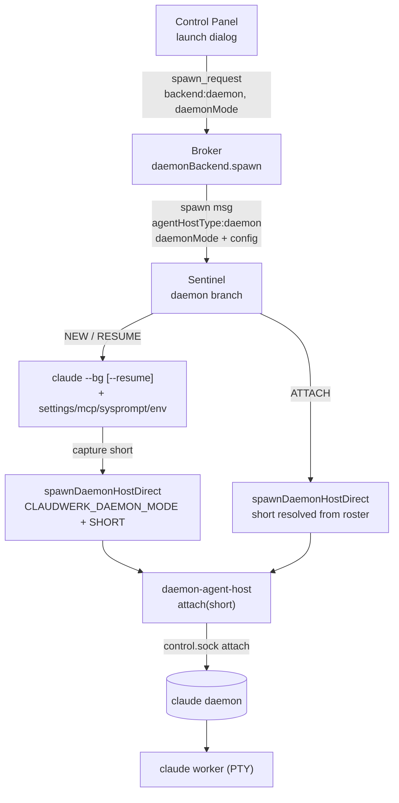

# Daemon Launch UX

How claudewerk launches, hosts, and remote-controls conversations backed by the
Claude Code background-session daemon (`claude daemon`) instead of a PTY or a
headless `--print` process.

**Status:** built and merged to `main` -- plan `plan-daemon-launch-ux.md`
phases A through I shipped 2026-05-19 / 2026-05-20.\
**Socket-level reference:** `docs/cc-daemon-socket-protocol.md` (framing,
the `attach` handshake, the `subscribe` schema, error codes). This document is
the layer above it -- the launch *experience* and the claudewerk plumbing.

---

## 1. What this is

Claude Code 2.1.x ships a background-session daemon. `claude --bg "<prompt>"`
dispatches a worker into that daemon; the daemon keeps the worker's PTY alive
and exposes a Unix-socket control protocol (`attach`, `list`, `reply`, `kill`,
`subscribe`, ...). A daemon worker is a normal interactive Claude Code session
that happens to be hosted out-of-process.

claudewerk's **daemon backend** makes such a worker a first-class conversation:
the control panel renders its transcript and terminal, the broker persists it,
and the user can reply, kill, and resume it -- exactly like a PTY conversation.

### Why -- the billing motivation

Headless (`claude --print`, claudewerk's stream-json backend) bills at **API
rate** from 2026-06-15. PTY and daemon-hosted sessions bill against the
**Anthropic subscription**. The daemon backend gives the streaming/structured
benefits of a managed host while keeping subscription billing. Phase I makes it
selectable as the default for agent-spawned conversations.

---

## 2. The three launch modes

One discriminator -- `daemonMode: 'new' | 'resume' | 'attach'` -- rides the
spawn request end to end. It is meaningful only when `backend === 'daemon'`.

```
MODE     MECHANISM                                   CONFIG INJECTION
------   ---------                                   ----------------
NEW      claude --bg "<prompt>" + flags + env        YES (settings / mcp /
         -> capture short -> attach                       sysprompt / env)
RESUME   claude --bg --resume <sessionId> + flags    YES (same set)
         -> capture short -> attach
ATTACH   worker already in the daemon roster         NO  (worker was already
         -> attach DIRECTLY (no claude --bg)              configured by
                                                          whoever dispatched it)
```

All three converge on the same `attach` socket op for PTY streaming. Only NEW
and RESUME run `claude --bg` first. Config injection (`--settings`,
`--mcp-config`, `--append-system-prompt`, per-spawn env) applies to NEW and
RESUME only -- ATTACH never touches `claude --bg`.

`daemonMode` is distinct from the pre-existing `SpawnRequest.mode`
(`'fresh' | 'resume' | ...`), which is a claude-agent-host worktree/git concept.

---

## 3. Architecture



| Layer | Owns |
|---|---|
| **Control panel** (`web/src/`) | Backend picker, mode selector, NEW/RESUME config form, ATTACH roster browser, launch profiles, remote-control UI. |
| **Broker** (`src/broker/`) | The `daemon` backend (spawn dispatch, conversationId reuse for ATTACH, launch-config persistence), roster forwarding, control-op routing. Never reads `ccSessionId`. |
| **Sentinel** (`src/sentinel/`) | Three-mode dispatch -- runs `claude --bg` for NEW/RESUME with flag injection, resolves the roster short for ATTACH, spawns the daemon-agent-host. |
| **Daemon-agent-host** (`src/daemon-agent-host/`) | Attaches to the daemon control socket, mirrors the worker transcript/PTY to the broker, observes the ccSessionId, runs reply/kill/respawn-stale. |
| **cc-daemon module** (`src/shared/cc-daemon/`) | The socket client -- framing, `attach`/`list`/`reply`/`kill`/`subscribe`, error classification. Backend-agnostic. |

---

## 4. What was built, per phase

Phases B-I ran in the `worktree-daemon-launch-ux` worktree; each shipped
independently with its own gate.

| Phase | Commit | What shipped |
|---|---|---|
| **A** | `7fde38a9` | Merge prerequisites for the daemon substrate: `fallow` cleared via the baseline route, `docs/cc-daemon-socket-protocol.md`, and the live NEW-mode E2E (`src/broker/__tests__/staging/daemon-e2e.test.ts`) green against a real 2.1.144 daemon. |
| **B** | `6902d93b` | daemon-agent-host mode support: `CLAUDWERK_DAEMON_MODE` (new/resume/attach), `attach-retry.ts` (ESTARTING/ENOJOB retry, never EPROTO), socket-drop re-attach, `session-observer.ts` rework, `transcript-path.ts`. |
| **C** | `364e4b4b` | Sentinel three-mode dispatch + config-flag injection (`--settings` / `--mcp-config` / `--append-system-prompt` / `--resume` / per-spawn env). New pure `src/sentinel/daemon-dispatch.ts`. |
| **D** | `7dfd66e0` | Broker spawn endpoint: `spawnRequestSchema` daemon fields + `refineDaemonSpawn`, `backends/daemon.ts` mode branching + ATTACH conversationId reuse + launch-config persistence, `DaemonLaunchEvent` wire message. |
| **E** | `38a21d1a` | Control panel launch dialog: daemon backend option (`Alt+5`), New/Resume/Attach segmented control, `daemon-mode-panel.tsx`, `daemon-roster-browser.tsx`, `use-daemon-roster.ts` + roster forwarding plumbing. |
| **F** | `4f78a65b`, `f576aa8c` | Launch profiles for daemon (`DaemonConfigSection`, profile round-trip) and the read-only "Launch config" disclosure on the conversation header (`LaunchConfigRow`). |
| **G** | `66b6b47e` | Remote control: reply / kill / respawn-stale, each emitting a typed `DaemonControlResult`; `daemon-control.ts`, broker `daemon_respawn_stale` handler, control-panel toasts + palette command. |
| **H** | `af9b260b` | Tier-2 live-smoke harness (`scripts/cc-daemon-launch-smoke.ts` + `launch-smoke*.ts`) covering NEW/RESUME/ATTACH end to end; 25 Tier-1 unit tests of the harness itself. |
| **I** | `9eeb59c2` | Cutover: the `defaultBackend` global-settings flag -- agent-spawned conversations adopt a configurable default backend. |

### Key modules

- **`src/shared/cc-daemon/`** -- `socket-path.ts`, `client.ts`, `subscribe.ts`,
  `attach.ts`, `ops.ts`, `types.ts`, `frame.ts`, `fake-daemon.ts`,
  `control-result.ts` (Phase G).
- **`src/daemon-agent-host/`** -- `index.ts`, `cli-args.ts`, `broker-bridge.ts`,
  `transcript-bridge.ts`, `session-observer.ts`, `attach-retry.ts`,
  `transcript-path.ts`, `daemon-control.ts`, `launch-smoke*.ts`.
- **`src/sentinel/`** -- `daemon-roster.ts` (chokidar + 10s poll, conversationId
  minting, persisted to `~/.claude/claudewerk-daemon-map.json`),
  `daemon-dispatch.ts`, plus `dispatchDaemonWorker` / `spawnDaemonHostDirect` /
  the `daemon` branch in `index.ts`.
- **`src/broker/`** -- `backends/daemon.ts`, `handlers/daemon.ts`,
  `handlers/socket-routing.ts`.
- **`web/src/`** -- `spawn-dialog/daemon-mode-panel.tsx`,
  `spawn-dialog/daemon-roster-browser.tsx`, `spawn-dialog/daemon-launch.ts`,
  `hooks/use-daemon-roster.ts`, `launch-profiles/editor-sections.tsx`
  (`DaemonConfigSection`), `lib/daemon-control.ts`.

---

## 5. Protocol surface

### SpawnRequest fields (`src/shared/spawn-schema.ts`)

| Field | Meaning |
|---|---|
| `backend: 'daemon'` | Routes the spawn to `daemonBackend.spawn`. |
| `daemonMode` | `'new' \| 'resume' \| 'attach'`, default `'new'`. |
| `daemonResumeSessionId` | The session id passed to `claude --bg --resume`. Required for `resume`. |
| `daemonAttachShort` | 8-hex daemon worker short id from the roster. Required for `attach`. |
| `daemonSettingsPath` | Absolute path on the sentinel host -> `--settings`. NEW/RESUME only. |
| `daemonMcpConfigPath` | Absolute path on the sentinel host -> `--mcp-config`. NEW/RESUME only. |

Cross-field rules live in `refineDaemonSpawn` (NEW needs a `prompt`, RESUME needs
`daemonResumeSessionId`, ATTACH needs `daemonAttachShort`).

### Wire messages (`src/shared/protocol.ts`)

`DaemonJobInfo`, `DaemonRosterUpdate`, `DaemonJobState` (roster ingest);
`DaemonLaunchStep` / `DaemonLaunchEvent` (launch timeline);
`DaemonControlResult` (every reply/kill/respawn-stale op);
`DaemonRespawnStaleRequest`, `DaemonPermissionResponse` (control contracts);
`DaemonRosterJob` / `DaemonRosterForward` / `DaemonRosterRequest` (the
ccSessionId-stripped roster forwarded to the control panel).

### The `defaultBackend` cutover flag

Phase I added `defaultBackend: 'daemon' | 'pty' | 'headless'` to the broker
global settings (`src/broker/global-settings.ts`).

- It governs **agent-spawned** conversations only -- MCP `spawn_conversation`
  and inter-conversation `channel_spawn`, which carry no explicit backend. The
  control panel spawn dialog always names a backend and is unaffected.
- `'daemon'` routes such spawns to a `claude --bg` NEW-mode daemon worker;
  `'pty'` / `'headless'` keep the claude backend at that launch mode.
- Resolution lives in `resolveDefaultBackend()` / `resolveSpawnConfig()`
  (`src/shared/spawn-defaults.ts`) and is applied up front in `dispatchSpawn`
  (`applyDefaultBackend`), which logs a `[spawn-backend]` decision line.
- **Default value: `'pty'`** -- the conservative pre-cutover value. The cutover
  is a one-setting ops flip to `'daemon'` (no redeploy), gated on the deferred
  follow-ups in section 7.

---

## 6. Design drift -- deviations from the original plan

The plan (`plan-daemon-launch-ux.md`) was written before the daemon was spiked
live. Several design assumptions did not survive contact. This section is the
durable record of every deviation; it is the most important part of this doc.

### 6.1 Spike-driven corrections (the daemon did not behave as assumed)

**`claude --bg --resume` forks to a fresh sessionId.** The plan assumed a
resumed worker keeps the resumed `<sessionId>`, so RESUME could pass it as a
`knownSessionId` and skip the post-dispatch `list` observation. **Wrong.**
`claude --bg --resume` behaves as if `--fork-session` were always on -- the
worker runs under a brand-new ccSessionId (the forked session still carries
full prior history). Consequences: the `knownSessionId` optimization was
dropped as moot; RESUME observes its ccSessionId post-dispatch via `list`
exactly like NEW; the transcript watcher points at the forked
`<newSessionId>.jsonl`, not the resume input id. `daemonResumeSessionId` is
therefore the session to fork *from*, never the worker's live identity.

**`/clear` does not rotate `JobRecord.sessionId`.** The plan assumed the
session-observer could detect an in-worker `/clear` by polling the daemon's
`JobRecord.sessionId`. **Wrong.** A daemon job's identity is fixed at dispatch
and immutable across `/clear`. What `/clear` actually does is make Claude Code
write a fresh transcript JSONL in the cwd's project directory -- the new JSONL
filename *is* the new ccSessionId. `session-observer.ts` was reworked: the
initial ccSessionId comes from `list` (or the newest-mtime JSONL for ATTACH),
and `/clear` rotation is detected by watching the project transcript directory
for a strictly-newer JSONL, never by `list`-polling. The daemon `short` is the
stable anchor; the rotating ccSessionId is the JSONL filename -- mirroring
claudewerk's own conversationId-vs-ccSessionId split.

**`ESTARTING` from `attach` almost never fires.** The plan budgeted for a race
where `attach` is called before the worker is ready. In practice `claude --bg`
blocks ~880ms and only returns the short once the worker is already attachable.
`attachWithRetry` stays as a cheap safety net but, on the NEW/RESUME path, will
essentially never retry.

### 6.2 Covenant-driven deviations (the boundary rule moved the design)

**RESUME session picker is free-text, not a picklist.** The plan proposed a
RESUME picklist showing `<ccSessionId prefix>` for each resumable session. The
broker may never expose a `ccSessionId` (boundary rule), so the broker cannot
source that picklist. `daemonResumeSessionId` is a free-text input instead. A
boundary-safe resumable-session source is left as a follow-up.

**The resume-from session id is kept out of the typed `LaunchConfig`.** Phase F
surfaces a read-only "Launch config" block on the conversation header. The
resume-from id is session-shaped, so it is *not* in the typed, control-panel
facing `LaunchConfig` -- it lives only in the opaque `agentHostMeta`
(`DAEMON_META.resume`) for revive rebuilding.

**Daemon profiles never persist per-launch fields.** Launch profiles for the
daemon backend omit `daemonResumeSessionId`, `daemonAttachShort`, and the
`attach` mode entirely -- those are per-launch inputs a profile cannot carry.
A profile's `daemonMode` is narrowed to `'new' | 'resume'`.

**The roster forwarded to the control panel is ccSessionId-stripped.** ATTACH
needs the daemon roster in the browser. The broker forwards it via an explicit
field allowlist (`toRosterJob` -> `DaemonRosterJob = Omit<DaemonJobInfo,
'sessionId'>`), so the broker never names `sessionId` and `lint:boundary` stays
clean with no whitelist entry.

### 6.3 Scope deferrals

**`permission-response` is deferred (Phase G).** The reply / kill /
respawn-stale slice shipped in full. The `permission-response` op was not
built: its request schema needs a live spike (drive a worker to a `tool_use`
gate, capture the `JobRecord.needs` payload, live-fire candidate field shapes
-- Section 8 spikes 5 and 6). `DaemonPermissionResponse` is defined as the
stable claudewerk wire contract and retained in the fallow dead-code baseline;
the handler + the cc-daemon op land once the spike resolves the schema.

**The Tier-2 live smoke green-run is deferred (Phase H).** The harness is built
in full, self-contained, runnable (`bun run smoke:daemon-launch`), and Tier-1
unit-smoked (25 tests). The live green-run against a real daemon needs an
authenticated `claude` install + subscription billing and was not run -- it is
cleanly deferred, not faked.

**The Phase I deploy + live confirm are deferred.** See section 7.

### 6.4 Naming / precision corrections

**`send_input` vs `input`.** The plan's Phase G files list said
`send_input -> daemon reply`. `send_input` is the broker control verb; on the
wire to the host it is the `input` message. The daemon-agent-host intercepts
`input`. Same intent, precise wire name.

**`defaultBackend` supersedes `defaultLaunchMode`.** Phase I's `defaultBackend`
flag became the global-tier launch authority. `resolveSpawnConfig` derives the
global launch mode from `defaultBackend` (`headless`->headless,
`pty`/`daemon`->pty), falling back to the legacy `global.defaultLaunchMode`
only when `defaultBackend` is absent. This was not a planned interaction -- it
emerged because both settings are global and overlapping. A side effect: it
*completes* the June-15 PTY-default safety net (commit `4f0f9942`), which had
been quietly undermined by `defaultLaunchMode`'s schema default of `'headless'`.
`global.defaultLaunchMode` is retained -- it still drives the spawn dialog's
initial toggle.

**Phase I default-of-the-default is `pty`, not `daemon`.** The plan's wording
("daemon becomes the default backend") implied the schema default should be
`'daemon'`. It is `'pty'`: the Tier-2 live smoke is still deferred, daemon NEW
needs a running daemon on the sentinel (PTY has no such dependency), and the
post-June-15 billing reclassification is not yet confirmable. The cutover
*mechanism* shipped; flipping it to `'daemon'` is a deliberate ops decision.

### 6.5 Additive -- modules not in the original files list

Several pure, side-effect-free helper modules were extracted to make logic
unit-testable without booting an entrypoint (`index.ts` files boot the
sentinel/host on import):

- `src/sentinel/daemon-dispatch.ts` -- argv assembly, the attach-presence gate,
  env merge, short parsing.
- `web/src/components/spawn-dialog/daemon-launch.ts` -- DOM-free form validation
  and `SpawnRequest`-shaping.
- `src/shared/cc-daemon/control-result.ts` -- `DaemonControlResult` builders.
- `src/daemon-agent-host/daemon-control.ts` -- the control-op runner.
- `src/broker/handlers/socket-routing.ts` -- `resolveConversationSocket`,
  de-duplicating host-socket resolution.
- `src/daemon-agent-host/transcript-path.ts` -- shared transcript-path derivation
  (de-dups realpath-slug logic; a Phase A bug came from slugging the raw cwd
  instead of its realpath under macOS `/var/folders` symlinks).
- `src/daemon-agent-host/launch-smoke-mirror.ts` -- the attach+mirror sequence
  lifted out of `index.ts` so the smoke harness can dogfood the real modules.

Also additive: the roster-forwarding wire messages (`DaemonRosterJob` /
`DaemonRosterForward` / `DaemonRosterRequest`) -- the ATTACH browser needs the
roster to actually reach the dashboard, which the original files list missed.

### 6.6 Process deviations (user instructions)

- **No scheduled smoke routine.** The plan (Section 6.2) proposed a `schedule`d
  routine or a self-hosted-runner workflow for the Tier-2 harness. Vetoed --
  the harness is a manual `bun run smoke:daemon-launch` only, run by hand
  pre-merge. Tier-2 is not the blocking gate.
- **`CLAUDE_CONFIG_DIR` is not isolated by the smoke harness.** Section 6.2
  asked for it; `transcript-path.ts` derives the worker transcript dir from
  `homedir()/.claude` and `claude` auth lives in `~/.claude`, so isolating the
  config dir would break the modules the harness dogfoods. Probe isolation
  comes from a unique bare temp cwd per probe instead.

---

## 7. Open follow-ups

| Follow-up | State |
|---|---|
| Deploy Phase I (broker rebuild + `build:web`) | Deferred 2026-05-20 by the user. Code is on `origin/main`; the flag defaults to `'pty'` so the deploy changes no behavior until the setting is flipped. |
| Live confirm of the cutover routing | Deferred -- needs the deploy. Phase A's `daemon-e2e.test.ts` already proved the daemon NEW path live; this confirms an agent spawn with no explicit backend resolving to daemon. |
| Re-verify daemon billing after 2026-06-15 | Date-gated -- not yet possible. The flip to `defaultBackend: 'daemon'` should wait on this (daemon workers must bill the subscription pool, not the API pool). |
| Tier-2 three-mode live smoke green-run | Deferred (Phase H) -- needs an authenticated `claude` + subscription billing. |
| `permission-response` op + handler | Deferred (Phase G) -- blocked on Section 8 spikes 5 and 6. |
| Boundary-safe resumable-session source for the RESUME picker | Open -- RESUME currently uses a free-text session id. |
| Sentinel-side (host-independent) respawn-stale | Possible follow-up -- respawn-stale currently routes through the daemon-agent-host and yields `EHOSTGONE` if the host already shut down. |

---

## 8. Testing

- **Tier-1 unit** -- `cc-daemon` (socket framing against `fake-daemon.ts`),
  `daemon-dispatch.test.ts`, `daemon-launch.test.ts`, `session-observer`,
  `attach-retry`, `backends/daemon.test.ts`, `spawn-schema.test.ts`,
  `spawn-defaults.test.ts`, the control-panel vitest suites, the smoke
  harness's own `launch-smoke.test.ts` (25 tests).
- **Tier-1 live E2E** -- `src/broker/__tests__/staging/daemon-e2e.test.ts`
  spawns the real `bin/daemon-host` against a staging broker and asserts the
  worker transcript mirrors through. Verified green against a real 2.1.144
  daemon (Phase A).
- **Tier-2 live smoke** -- `bun run smoke:daemon-launch` runs NEW + RESUME +
  ATTACH end to end against a real daemon, asserting transcript continuity,
  job state, and protocol. Not in the blocking gate; live green-run deferred.

---

## 9. Reference

- `docs/cc-daemon-socket-protocol.md` -- the socket-level protocol.
- `.claude/docs/plan-daemon-launch-ux.md` -- the implementation plan with the
  full per-phase STATUS blocks (the authoritative deviation record).
- `.claude/docs/plan-claude-agents-integration.md` -- the originating substrate
  plan (daemon recon, Phases 0.5-2).
- `.claude/docs/cc-daemon-control-protocol.md` -- the binary reverse-engineering
  notes and the live spike log.
